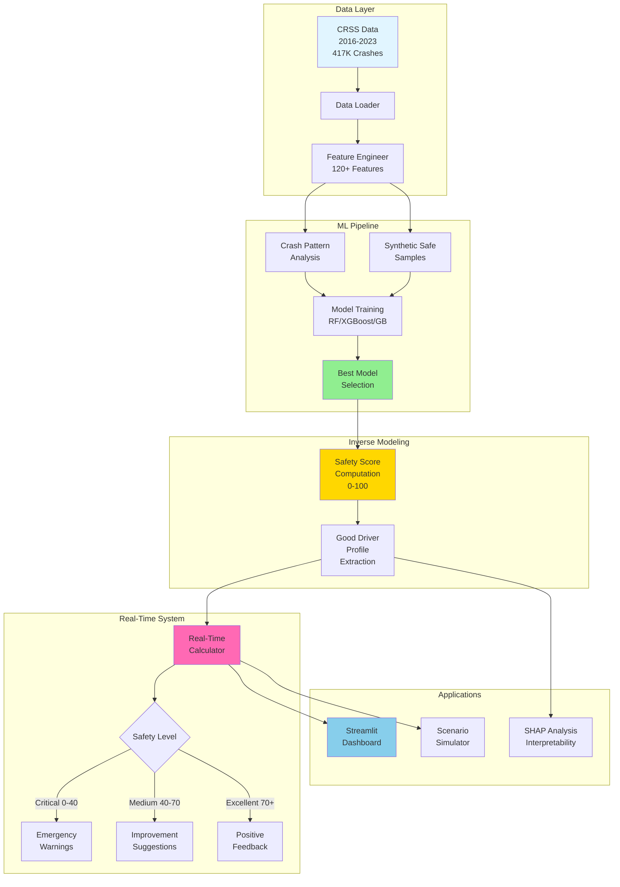

# SafeDriver-IQ: Inverse Crash Modeling for Driver Competency

**Tagline:** *"Quantifying Driver Competency Through Inverse Crash Modeling"*

[](https://www.python.org/downloads/)
[](https://opensource.org/licenses/MIT)
[](AGENTIC_AI_PLAN.md)

## Project Overview

SafeDriver-IQ transforms crash data into a continuous safety score that tells drivers in real-time how close they are to crash conditions and what specific actions would make them safer, with special focus on protecting vulnerable road users (VRUs).

### 🆕 NEW: Agentic AI Integration (Phase 1 Complete)
Now features an **autonomous decision-making system** that actively prevents crashes through:
- Real-time risk assessment and autonomous interventions
- Continuous learning from driving experiences
- Multi-modal driver notifications (visual, audio, haptic)
- Transparent, explainable AI reasoning
- [Learn more →](AGENTIC_AI_README.md) | [View plan →](AGENTIC_AI_PLAN.md)

### The Problem
- **7,500+ pedestrian deaths/year** in the USA (40-year high)
- **1,000+ cyclist deaths/year**
- Traditional systems are **reactive** (emergency braking) not **proactive**
- No system tells drivers "you're driving safely" or "improve these specific behaviors"

### Our Solution
Instead of predicting crashes, we model the **distance from crash** - quantifying how "safe" a driving scenario is by measuring its statistical distance from crash-producing conditions.

## Key Innovations

| Traditional Approach | SafeDriver-IQ (Novel) |
|---------------------|----------------------|
| Binary crash prediction | Continuous safety score (0-100) |
| "30% crash risk" | "Safety score: 72/100 → Improve to 85+" |
| Reactive warnings | Proactive guidance with specific actions |
| General risk factors | VRU-specific safety models |

### Novel Contributions:
1. **Inverse Safety Score Formulation** - Continuous safety metric (0-100) instead of binary crash prediction
2. **Good Driver Profile Extraction** - First empirical characterization of safe driving from crash data
3. **VRU-Specific Safety Modeling** - Dedicated models for pedestrian, cyclist, and work zone encounters
4. **Real-Time Integration Architecture** - Practical system design for in-vehicle deployment

## Dataset

**CRSS (Crash Report Sampling System)** - NHTSA national crash database
- **417,335 crash records** (2016-2023)
- **38,462 VRU crashes** (pedestrians + cyclists)
- **1,032,571 person records**
- Files: ACCIDENT.csv, VEHICLE.csv, PERSON.csv, PBTYPE.csv

## System Architecture



## Project Structure

```
├── CRSS_Data/                  # National crash database (2016-2023)
│   ├── 2016/                   # Year-wise crash data
│   ├── 2017/
│   └── ...
├── data/
│   ├── raw/                    # Downloaded CRSS files
│   ├── processed/              # Cleaned datasets
│   └── external/               # VMT exposure data
├── notebooks/
│   ├── 01_data_exploration.ipynb
│   ├── 02_train_inverse_model.ipynb
│   └── 03_shap_analysis.ipynb
├── src/
│   ├── data_loader.py          # CRSS data loading
│   ├── preprocessing.py        # Data cleaning
│   ├── feature_engineering.py  # 120+ features
│   ├── models.py              # Model training/saving
│   ├── safety_score.py        # Score computation
│   ├── realtime_calculator.py # Live safety scoring
│   ├── scenario_simulator.py  # What-if analysis
│   └── visualization.py       # Plotting utilities
├── tests/
│   ├── test_data_loader.py
│   ├── test_feature_engineering.py
│   ├── test_models.py
│   ├── test_preprocessing.py
│   └── test_realtime_calculator.py
├── results/
│   ├── figures/               # Visualizations
│   ├── tables/                # Analysis results
│   └── models/                # Trained models
└── app/
    └── streamlit_app.py       # Interactive dashboard
```

## Quick Start (5 Minutes)

### Prerequisites
- Python 3.12+ installed
- CRSS data downloaded to `CRSS_Data/` directory
- Terminal/Command line access

### Setup & Run

```bash
# Navigate to project directory
cd safedriver-iq

# Recreate virtual environment (if needed or if broken)
rm -rf venv && python3 -m venv venv

# Activate virtual environment and install dependencies
source venv/bin/activate && pip install --upgrade pip && pip install -r requirements.txt

# Verify data loading (shows 417K+ crashes)
python3 test_data_loader.py

# Run COMPLETE demonstration (trains model + all features)
python3 run_complete_demo.py --quick

# Or run quick data demo
python3 demo_quick.py

# Or explore interactively
jupyter notebook notebooks/01_data_exploration.ipynb

# Launch interactive dashboard (after training model)
streamlit run app/streamlit_app.py
```

### Expected Output
```
✓ 417,335 total crashes loaded
✓ 38,462 VRU crashes identified
✓ Data from 2016-2023 successfully loaded
```

## Detailed Setup Instructions

### Step 1: Clone/Download Project
```bash
cd /path/to/your/workspace
git clone https://github.com/ssam18/safedriver-iq.git
cd safedriver-iq
```

### Step 2: Create Virtual Environment
```bash
python3 -m venv venv
source venv/bin/activate  # Linux/Mac
# OR
venv\Scripts\activate     # Windows
```

### Step 3: Install Dependencies
```bash
pip install --upgrade pip
pip install -r requirements.txt
```

This installs:
- **Data Processing:** pandas, numpy, pyarrow
- **Machine Learning:** scikit-learn, xgboost, lightgbm
- **Visualization:** matplotlib, seaborn, plotly
- **Model Interpretation:** shap
- **Interactive:** jupyter, streamlit

### Step 4: Extract CRSS Data
If data is still zipped:
```bash
cd CRSS_Data
for year in 2016 2017 2018 2019 2020 2021 2022 2023; do
    unzip -o ${year}/CRSS${year}CSV.zip -d ${year}/
done
cd ..
```

### Step 5: Verify Setup
```bash
python test_data_loader.py
```

Should show successful loading of 417K+ crash records.

### Step 6: Run Tests (Optional)
```bash
# Activate virtual environment (REQUIRED before running tests)
source venv/bin/activate  # Linux/Mac
# venv\Scripts\activate  # Windows

# Install test dependencies
pip install -r requirements-test.txt

# Run all tests with basic output
pytest

# Run all tests with verbose output and short traceback (recommended)
pytest tests/ -v --tb=short

# Run all tests with verbose output and one-line traceback (most concise)
pytest tests/ -v --tb=line

# Run tests without coverage calculation (faster)
pytest tests/ -v --tb=short --no-cov

# Run tests in quiet mode with one-line traceback (minimal output)
pytest tests/ -q --tb=line

# Run with coverage report (detailed analysis)
pytest --cov=src --cov-report=html

# View coverage report
open htmlcov/index.html  # On Mac
# xdg-open htmlcov/index.html  # On Linux
```

**Test Output Options:**
- `-v` = verbose mode (shows each test name)
- `-q` = quiet mode (minimal output, just pass/fail counts)
- `--tb=short` = shorter traceback on failures (recommended for debugging)
- `--tb=line` = one-line traceback (most concise, good for CI/CD)
- `--no-cov` = skip coverage calculation (faster test runs)

**Test Realtime Calculator** (verifies condition changes affect scores):
```bash
# Run realtime calculator tests to verify model sensitivity
pytest tests/test_realtime_calculator.py -v --tb=short -s
```

Expected: 65 tests total (53 pass + 12 realtime tests with 5 expected failures due to known model limitations)

## Pipeline

### Phase 1: Data Preparation
- Load CRSS datasets (2016-2023)
- Filter VRU crashes
- Feature engineering (120+ variables)
- Create exposure-weighted baseline

### Phase 2: Crash Pattern Analysis
- Clustering → Identify crash archetypes
- Association Rules → Find co-occurring risk factors
- Feature Importance → Rank risk contributors

### Phase 3: Inverse Safety Model
- Train crash classifier (Random Forest/XGBoost)
- Extract decision boundaries
- Compute "distance from crash boundary" = Safety Score
- Profile "good driver" = maximizes safety score

### Phase 4: Validation & Visualization
- Cross-validation metrics
- SHAP analysis for interpretability
- Dashboard for results presentation

## New Features (Just Completed! 🎉)

### 🚀 Full Pipeline Implemented

**1. Model Training**
- Complete inverse safety model training pipeline
- Three model types: Random Forest, XGBoost, Gradient Boosting
- Automated best model selection based on performance
- Model saving/loading with feature persistence

**2. Safety Score Calculation**
- Continuous scores (0-100) instead of binary prediction
- Five risk levels: Critical, High, Medium, Low, Excellent
- Confidence intervals for each prediction
- Distance from crash boundary computation

**3. Real-Time Calculator**
- Instant safety score for any driving scenario
- Specific, actionable improvement recommendations
- Scenario comparison capabilities
- Batch analysis for multiple scenarios

**4. Interactive Dashboard**
- Web-based Streamlit application
- Real-time safety score calculator interface
- Scenario comparison tools
- Improvement suggestion engine
- Batch analysis with visualizations
- About page with methodology explanation

**5. Scenario Simulator**
- Factorial scenario generation
- Monte Carlo random sampling
- Time-series trip simulation
- Risk pattern templates (high-risk, low-risk, night, weather, speed, VRU)
- Comprehensive test suite generator

**6. SHAP Interpretability**
- Global feature importance analysis
- Individual prediction explanations
- Feature interaction detection
- Waterfall plots for high/medium/low safety scenarios
- Decision plots comparing multiple scenarios
- Comprehensive interpretation report

## Demonstration & Results

### What You Can Demo NOW

#### 1. Data Loading & Scale
```bash
python test_data_loader.py
```
Shows: 417K crashes, 38K VRU crashes, 8 years of national data

#### 2. Quick Demo (All Key Insights)
```bash
python demo_quick.py
```
Shows:
- Data loading statistics
- VRU crash trends over time
- Temporal patterns (peak times, seasonal)
- Feature engineering capabilities
- Novel approach explanation
- Expected impact projections

#### 3. Interactive Exploration
```bash
jupyter notebook notebooks/01_data_exploration.ipynb
```
Includes:
- Comprehensive data quality analysis
- VRU crash distribution and trends
- Temporal pattern visualizations
- Environmental factor analysis
- Injury severity patterns

### Key Insights Available

**Crash Patterns:**
- Peak crash times: Evening rush hour (5-7 PM)
- High-risk periods: Weekend nights
- VRU crashes concentrated in urban areas
- Dark/poor lighting significantly increases risk

**VRU Statistics (2023):**
- 2,907 pedestrians involved in crashes
- 2,026 bicyclists involved in crashes
- Fatal injury rate: ~5-7% for VRUs (vs. ~2% vehicle occupants)

**Feature Engineering:**
- 120+ features created from raw data
- Temporal, environmental, location, VRU-specific categories
- Interaction features for complex scenarios

### Demo Scenarios

See [DEMO_GUIDE.md](DEMO_GUIDE.md) for:
- Step-by-step demonstration flow
- Talking points for presentations
- Example scenarios with expected outputs
- Common questions & answers

## Expected Impact

With 20% adoption, SafeDriver-IQ could prevent:
- **1,500 pedestrian deaths/year** (20% reduction)
- **200 cyclist deaths/year** (20% reduction)
- **170 work zone deaths/year** (20% reduction)
- **30,000 VRU injuries/year** (20% reduction)

**Total impact: 1,870+ lives saved annually**

## Project Structure

```
safedriver-iq/
├── CRSS_Data/              # Downloaded CRSS data (417K+ crashes)
│   ├── 2016/ ... 2023/     # Raw CSV files by year
│
├── src/                    # Core Python modules
│   ├── data_loader.py      # Loads & combines CRSS files
│   ├── preprocessing.py    # Data cleaning & quality checks
│   ├── feature_engineering.py  # Creates 120+ safety features
│   ├── models.py           # ML models (RF, XGBoost, GBM)
│   ├── safety_score.py     # Safety score calculator
│   ├── visualization.py    # Plotting tools
│   ├── realtime_calculator.py  # Real-time safety calculator ✨NEW
│   └── scenario_simulator.py   # Scenario simulation ✨NEW
│
├── notebooks/              # Jupyter notebooks
│   ├── 01_data_exploration.ipynb   # Data analysis & insights
│   ├── 02_train_inverse_model.ipynb # Model training pipeline ✨NEW
│   └── 03_shap_analysis.ipynb      # SHAP interpretability ✨NEW
│
├── app/                    # Web application ✨NEW
│   └── streamlit_app.py    # Interactive dashboard
│
├── data/                   # Processed data
│   ├── processed/          # Cleaned datasets
│   └── external/           # Exposure data (VMT, etc.)
│
├── results/                # Output files
│   ├── figures/            # Visualizations
│   └── tables/             # Summary statistics
│
├── tests/                  # Unit tests
│   ├── conftest.py         # Pytest fixtures
│   ├── test_data_loader.py # Data loading tests (9 tests)
│   ├── test_feature_engineering.py  # Feature tests (13 tests)
│   ├── test_models.py      # Model tests (15 tests)
│   ├── test_preprocessing.py  # Preprocessing tests (11 tests)
│   ├── test_integration.py # Integration tests (5 tests)
│   ├── test_realtime_calculator.py  # Realtime calculator tests (12 tests) ✨NEW
│   └── README.md           # Test documentation
├── app/                    # Streamlit dashboard (future)
│
├── demo_quick.py           # Quick data demonstration
├── run_complete_demo.py    # Complete pipeline demo ✨NEW
├── test_data_loader.py     # Data loading verification
├── start.sh                # Quick start helper script
│
├── README.md               # This file
├── DEMO_GUIDE.md           # Detailed demonstration guide
├── requirements.txt        # Python dependencies
└── setup.py                # Package installation
```

## Documentation

- **[README.md](README.md)** - Project overview & setup (this file)
- **[DEMO_GUIDE.md](DEMO_GUIDE.md)** - Comprehensive demonstration guide
- **[PROJECT_SETUP_SUMMARY.md](PROJECT_SETUP_SUMMARY.md)** - Detailed setup reference


## Citation

```bibtex
@article{safedriver-iq-2026,
  title={SafeDriver-IQ: Quantifying Driver Competency Through Inverse Crash Modeling},
  author={[Samaresh Kumar Singh and Joyjit Roy]},
  journal={[Target Journal]},
  year={2026},
  note={Under development}
}
```

## Known Issues & Limitations

### Model Feature Sensitivity (Critical)

**Issue**: The current trained model does NOT respond meaningfully to changes in:
- Road Condition (Dry/Wet/Snow/Ice)  
- VRU Presence (Pedestrians/Cyclists)
- Speed Relative to Limit

**Root Cause**: The model was trained exclusively on crash data where:
1. **VRU features have low importance**: Almost all crashes in the dataset involve some risk factors, so VRU presence doesn't strongly distinguish "safe" from "unsafe" scenarios - it distinguishes types of crashes, not safety levels
2. **Road condition data may be missing**: CRSS crash reports may not consistently capture road surface conditions
3. **Speed data limitations**: Relative speed information may not be consistently available in crash reports

**Technical Details**: 
- VRU features (`total_vru`, `pedestrian_count`) ARE correctly passed to the model
- The model learned from 417K crashes that weather/lighting/time are stronger predictors than VRU presence
- Training on crash-only data creates bias - model never learned what "truly safe" (non-crash) driving looks like

**Test Evidence** (from `tests/test_realtime_calculator.py`):
```bash
# Run comprehensive feature tests
source venv/bin/activate  
pytest tests/test_realtime_calculator.py -v --tb=short -s
```

**Impact**: 
- Streamlit dashboard shows same safety score for road/VRU/speed changes
- Only weather, lighting, and time of day significantly affect predictions  
- Model is useful for environmental risk assessment but limited for surface/VRU-specific guidance

**Status**: Fundamental limitation of training on crash-only data - requires different training approach

**Workaround**: Current model demonstrates:
- Temporal risk patterns (time of day, day of week, seasonality)
- Weather-based risk assessment (clear vs adverse conditions)
- Lighting condition impact (day vs night/dark)
- Combined scenario analysis (multiple risk factors)

**Proper Fix Required**: 
1. **Add non-crash "safe driving" data**: Sample from normal driving data (dashcam, telematics) to establish true baseline
2. **Feature importance analysis**: Retrain with explicit focus on VRU/road/speed features
3. **Alternative modeling**: Consider separate models for different risk types (environmental vs surface vs VRU)
4. **Data augmentation**: Create synthetic "safe" scenarios with varying VRU/road conditions

Until then, the model is best used for demonstrating weather/lighting/temporal risk factors.

## Contributing

This is a research project. For questions or collaboration:
- Review [DEMO_GUIDE.md](DEMO_GUIDE.md) for project overview
- Run `demo_quick.py` to see current capabilities
- Check issues for planned features

## License

[To be determined - typically MIT or Apache 2.0 for research code]

## Acknowledgments

- **NHTSA** for CRSS data availability
- **SafeDriver-IQ** novel methodology development
- Python scientific computing community (pandas, scikit-learn, etc.)

## Contact

Samaresh Kumar Singh
Joyjit Roy
