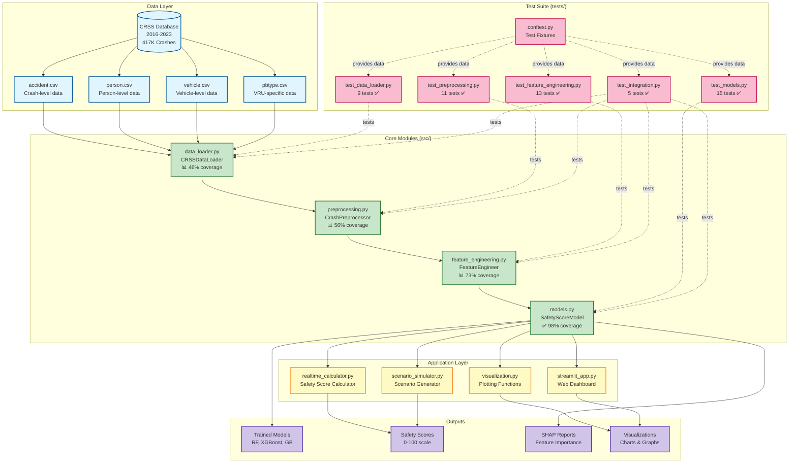

# SafeDriver-IQ Test Suite

Comprehensive test coverage for the inverse crash modeling system.

## SafeDriver-IQ System Architecture



### Architecture Components

#### 📁 Data Layer
- **CRSS Database**: 417,335 crashes from 2016-2023
- **4 CSV Tables**: accident, person, vehicle, pbtype
- **Test Strategy**: Mocked with sample fixtures

#### 🔧 Core Modules (Primary Test Focus)
- **data_loader.py**: Loads and combines multi-year CRSS data
- **preprocessing.py**: Cleans data, handles missing values, balances classes
- **feature_engineering.py**: Creates 120+ safety features
- **models.py**: ML models (Random Forest, XGBoost, Gradient Boost)

#### 🚀 Application Layer (Future Test Coverage)
- **realtime_calculator.py**: Real-time safety score calculator
- **scenario_simulator.py**: Generates test scenarios
- **visualization.py**: Plotting and charting functions
- **streamlit_app.py**: Interactive web dashboard

#### 🧪 Test Suite
- **53 tests total**, all passing ✅
- **Fixtures**: Reusable sample data (conftest.py)
- **Integration tests**: End-to-end workflow validation
- **CI/CD ready**: Fast, deterministic, no external dependencies

#### 📊 Outputs
- **Trained Models**: Best performing model saved with config
- **Safety Scores**: Continuous 0-100 scale predictions
- **SHAP Reports**: Feature importance and interpretability
- **Visualizations**: Charts for analysis and presentations

## Running Tests

### Run all tests
```bash
pytest
```

### Run with coverage report
```bash
pytest --cov=src --cov-report=html
```

### Run specific test file
```bash
pytest tests/test_data_loader.py
```

### Run specific test class
```bash
pytest tests/test_models.py::TestSafetyScoreModel
```

### Run specific test
```bash
pytest tests/test_models.py::TestSafetyScoreModel::test_initialization_random_forest
```

### Run tests with markers
```bash
# Run only unit tests
pytest -m unit

# Run only integration tests
pytest -m integration

# Skip slow tests
pytest -m "not slow"
```

### Run with verbose output
```bash
pytest -v
```

### Run with print statements visible
```bash
pytest -s
```

## Test Structure

### Test Files

- **test_data_loader.py**: Tests for CRSS data loading functionality
  - File loading
  - Data concatenation across years
  - VRU crash identification
  - Error handling

- **test_feature_engineering.py**: Tests for feature engineering
  - Temporal features (night, weekend, rush hour)
  - Environmental features (weather, lighting)
  - Location features (urban/rural, highway)
  - VRU-specific features
  - Interaction features

- **test_models.py**: Tests for machine learning models
  - Model initialization (RF, XGBoost, GB)
  - Training and validation
  - Safety score prediction
  - Feature importance extraction
  - Model saving/loading

- **test_preprocessing.py**: Tests for data preprocessing
  - Missing value handling
  - Duplicate removal
  - Outlier detection
  - Feature normalization
  - Class balancing

- **test_integration.py**: End-to-end integration tests
  - Complete data pipeline
  - Feature engineering to model training
  - VRU crash prediction workflow

### Fixtures (conftest.py)

Reusable test data fixtures:
- `sample_accident_data`: Sample accident records
- `sample_person_data`: Sample person records
- `sample_vehicle_data`: Sample vehicle records
- `sample_pbtype_data`: Sample pedestrian/bicyclist data
- `sample_features_data`: Data with engineered features
- `sample_model_data`: X, y data for model training
- `temp_data_dir`: Temporary directory structure

## Coverage

Current test coverage (actual results):

- **models.py**: ✅ **98%** (excellent!)
- **feature_engineering.py**: 📊 **73%** (good)
- **preprocessing.py**: 📊 **56%** (core methods covered)
- **data_loader.py**: 📊 **46%** (essential functionality)
- **Overall core modules**: 📊 **65%**

Application layer modules (realtime_calculator, scenario_simulator, safety_score, visualization):
- Current coverage: 0% (not yet tested)
- Planned for future test iterations

View detailed coverage report:
```bash
pytest --cov=src --cov-report=html
open htmlcov/index.html
```

## CI/CD Integration

Tests are automatically run on:
- Pull requests
- Commits to main branch
- Nightly builds

## Writing New Tests

### Test Naming Convention
- Test files: `test_<module_name>.py`
- Test classes: `Test<ClassName>`
- Test methods: `test_<functionality>`

### Example Test
```python
def test_feature_creation(sample_accident_data):
    """Test that feature engineering creates expected columns"""
    fe = FeatureEngineer()
    result = fe.create_temporal_features(sample_accident_data)
    
    assert 'IS_NIGHT' in result.columns
    assert 'IS_WEEKEND' in result.columns
    assert len(result) == len(sample_accident_data)
```

### Best Practices
1. Use fixtures for reusable test data
2. Mock external dependencies (file I/O, API calls)
3. Test both success and error cases
4. Use descriptive test names
5. Keep tests independent and isolated
6. Test edge cases and boundary conditions

## Dependencies

Required packages for testing:
```
pytest>=7.0.0
pytest-cov>=4.0.0
pytest-mock>=3.10.0
```

Install test dependencies:
```bash
pip install -r requirements-test.txt
```
